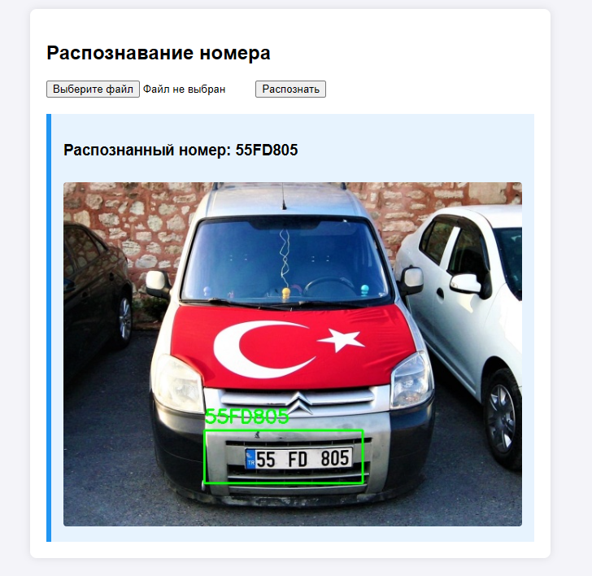

# Plate detector
Распознает номера машин с фотографий и выводит их

# Установка
Необходимо:
- [Python 3.12](https://www.python.org/downloads/release/python-31214/)

Библиотеки:
- flask
- easyocr (1.7.1)
- opencv-python
- numpy (<2)

`pip install easyocr==1.7.1 "numpy<2" opencv-python flask`

После этого просто запустите `main.py` и переходите на `http://127.0.0.1:5000/`
 
